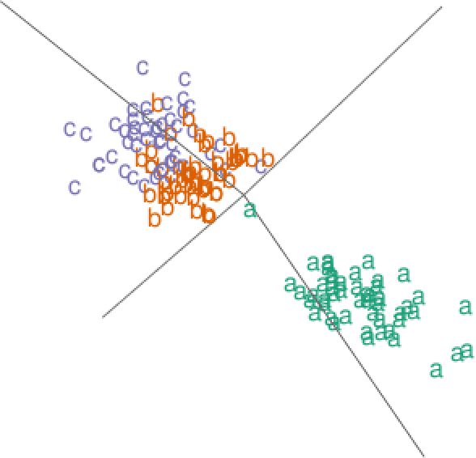

```{r setup, include = FALSE}
knitr::opts_chunk$set(
  warning = FALSE, message = FALSE, error = FALSE,
  collapse = TRUE, comment = "#>", out.width = "100%",
  fig.path = "man/figure/README"
)
```
## Introduction
This package is developed for 3D radial visualization of high-dimensional and mixed-featured datasets. We propose a Max-Ratio Projection (MRP) method that utilizes the group information in high dimensions to provide distinctive lower-dimensional projections that are then displayed in the 3D space. Our methodology is extended to datasets with discrete and mixed features where a generalized distributional transform (GDT) is used in conjuction with copula models before applying MRP and the 3D visualization. Our display engine is called starcoords3D that extends the classic 2D star coordinates visualization and displays multivariate data on the 3D space. This document gives a brief introduction to the functions included in \texttt{mixedviz} with several application examples.

### Instructions for interactive views
The 3D interactive plots are implemented with the \texttt{rgl} functions and here are instructions for manipulation:
- Rotation: Click and hold with the left mouse button, then drag the plot to rotate it and gain different perspectives.
- Resize: Zoom in and out with the scroll wheel, or the right mouse button.

## Functions

\texttt{mixedviz} contains 3 functions:

- `Gtrans`: Transform discrete or mixture of discrete and continuous datasets to continuous datasets with marginal normal(0,1).
- `mrp`: Project high-dimensional datasets to lower dimension with max-ratio projection.
- `plot.starcoords3D`: Star coordinates visualization of appropriately transformed datasets in the 3D space.

The three functions together are able to displays and classifies data points from the pre-known groups and provide visual clues to how the grouped data are separately from each other. 

## Examples

We illustrate the usage of `Gtrans`, `mrp` and `plot.starcoords3D`on datasets with continuous or discrete features. The interactive 3D plot are produced from `rgl` and can be rotated manually to get better perspectives on `rgl`-supported devices.

### Displaying small and continuous datasets

For small datasets with all continuous features, function `plot.starcoords3D` can be applied directly on the original data matrix. The 3D plot below are displayed for the (Fisher's or Anderson's) iris data. The dataset contains 50 flowers measurements for 4 variables, sepal length, sepal width, petal length and petal width which are represented by the 4 anchor points in the plot. Flowers come from each of 3 species, Iris setosa, Iris versicolor, and Iris virginica. Speicies groups are shown in different colors and tagged with name labels.

```{r}
library(mixedviz)
data("iris")
plot.starcoords3D(data = iris[,-5], class = iris[,5])
```
```{r echo=FALSE}
# rgl::rgl.viewpoint(zoom = 0.85)
# rgl::rglwidget()
```



### Display high-dimensional datasets with mixed features

Datasets with large dimensions and discrete values can be transformed using `Gtrans` (currently not applicable to categorical variables), and then be reduced using `mrp`. Here we present an example for an Indic scripts dataset (reference link: \url{https://sites.google.com/site/skmdobaidullah/dataset-code}) which is on 116 different features from handwritten scripts of 11 Indic languages. A subset of 5 languages is chosen from 4 regions, namely Bangla (from the east), Gurmukhi (north), Gujarati (west), and Kannada and Malayalam (languages from the neighboring southern states of Karnataka and Kerala) and a sixth language (Urdu, with a distinct Persian script). Some of the features contains discrete values so the dataset is essentially of mixed attributes. We apply `plot.starcoords3D` on the data processed with GDT and MRP to display the similarities and distinctiveness of samples from each languages.

```{r}
library(mixedviz)
data("scripts")
scriptdf = Gtrans(data = sn.g.df[,-117])
scriptdf = mrp(data = scriptdf, cl = sn.g.df[,117], npc = 4)
plot.starcoords3D(data = scriptdf, pradius = 0.06, class = factor(sn.g.df[,117]))
```
```{r echo=FALSE}
# rgl::rgl.viewpoint(zoom = 0.4)
# rgl::rglwidget()
```


